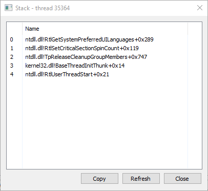
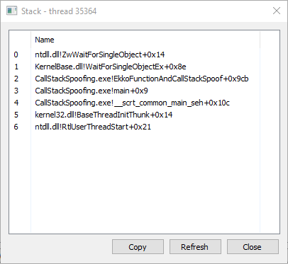
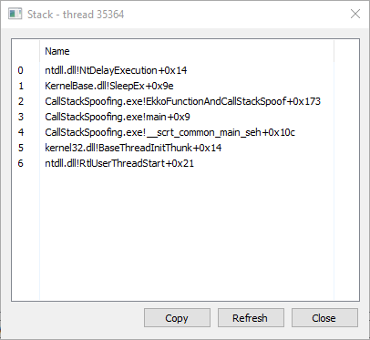
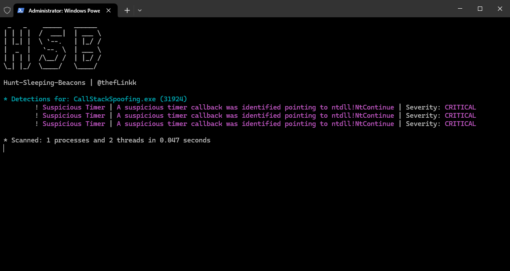
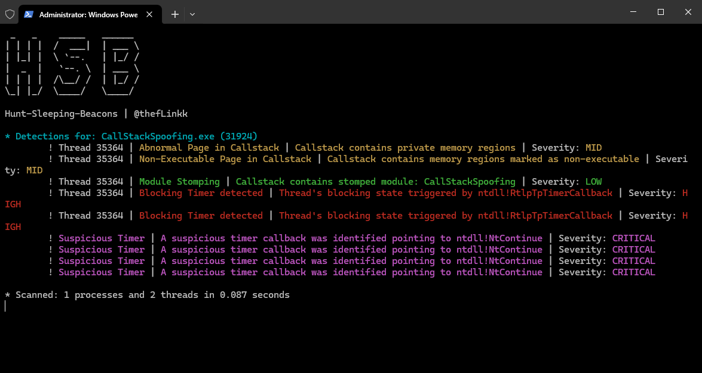

# Call Stack Spoofing Notes
After implementing Call Stack Spoofing, the stack of the worker thread executing the things as per timers gets set onto the main thread.

The following things are observed with the stack of the main thread.
1. When the main thread is waiting for `hEvent` to be set. 

2. When the image is decrypted 

3. The small Sleep segment where we want to wait for the context to be captured. 

## Hunt Sleeping Beacons
[HSB](https://github.com/thefLink/Hunt-Sleeping-Beacons) is able to detect the previously critical issues, however all other issues go away. The following patterns are observed: 

1. When the main thread is waiting for `hEvent` to be set. 

2. When the image is decrypted 

> The second image depicts the moment in time when the image is decrypted and the call stack is genuine. However, if the sleep time is very large, it is very much possible that HSB cannot be manuall used to spot a sleeping beacon.

> Note: The Critical issue still exists, where HSB detects a timer which has its callback pointed to NtContinue. To get by that, its best if NtContinue is abandoned and other ways are found or perhaps when dynamic call stack spoofing is done, I'll find out when I actually get that done too.