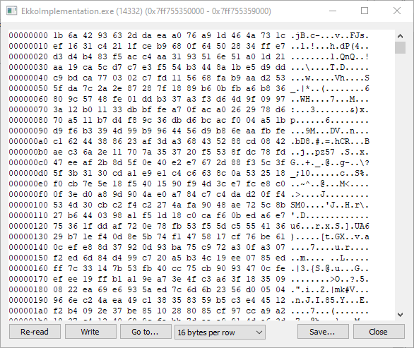
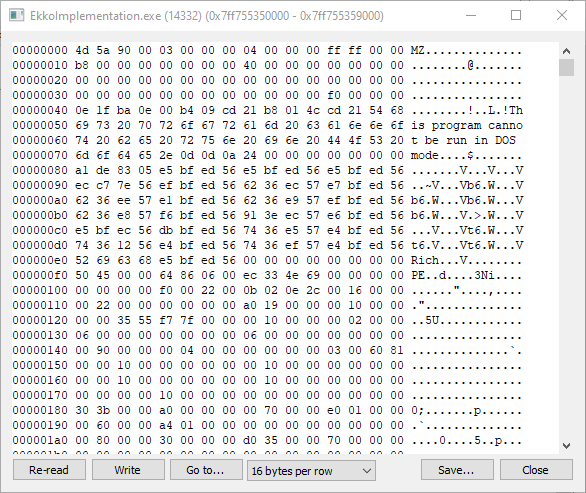
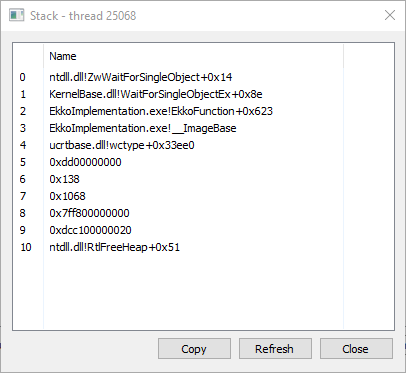
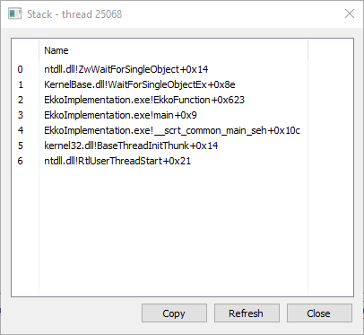
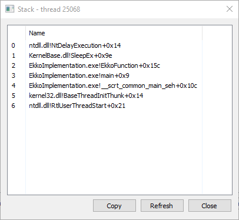
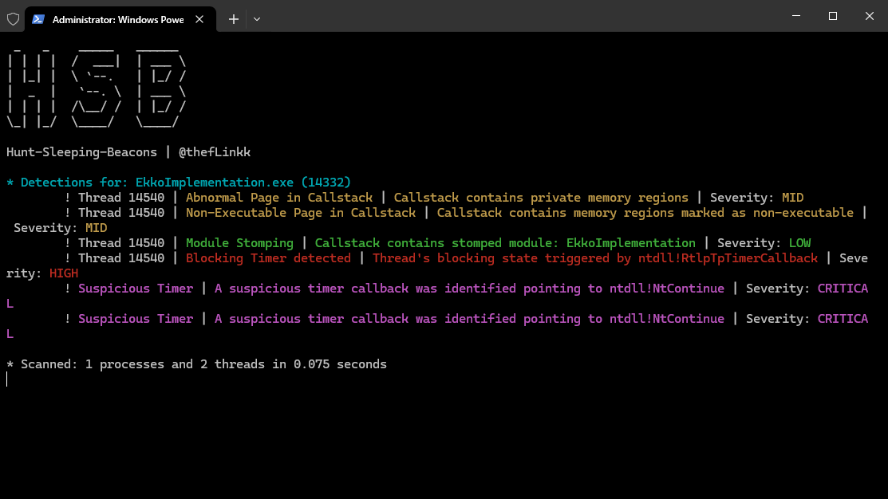

# Ekko Notes
While implementing Ekko, the binary image becomes encrypted during sleep time 

When the sleep time finishes, the binary image gets decrypted for the time we need to execute rest of the things.

Since the whole image gets encrypted, hence our callstack also gets corrupted. There are three situations which our call stack is in:

1. When the main thread is waiting for `hEvent` to be set. 

2. When the image is decrypted 

3. The small Sleep segment where we want to wait for the context to be captured.

## Hunt Sleeping Beacons
[HSB](https://github.com/thefLink/Hunt-Sleeping-Beacons) is able to detect these issues in the call stack and list our the following issues: 

1. When the main thread is waiting for `hEvent` to be set. 

2. When the image is decrypted 

> The critical issues are something that I will target at a later stage, first analysis of detection of Blocked Timers is something i want to remove while following along [Dylan Tran's modification to Ekko](https://dtsec.us/2023-04-24-Sleep/).