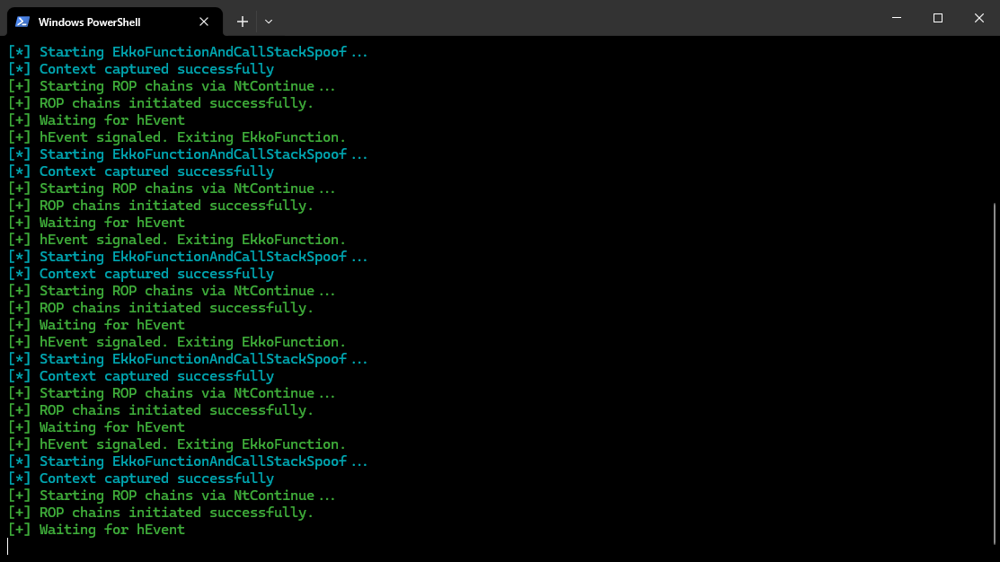
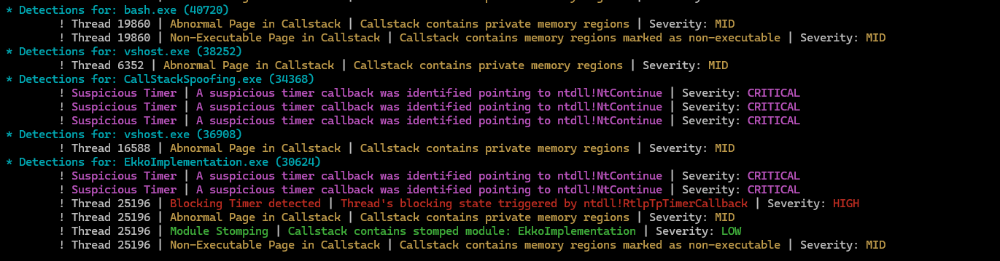

# Ekko

This is an ekko rebuild to understand what is actually happening when ekko sleep obfuscation takes place.
Original Code : [Cracked5pider](https://github.com/Cracked5pider/Ekko)

## Ekko Flow
1. Obtain the context of current thread
2. Clone the context to multiple variables
3. Modify variables to resume execution as if they were about to execute functions in the execution sequence.
4. Use System timers to resume context using NtContinue in a particular sequence.
5. Wait for all the context based functions to execute.
6. Delete TimerQueue

Ideally, this would go in a a loop where the EkkoSleep will replace sleep for the time where an implant is gonna sleep and not be a decrypted payload in the memory.

## Execution Sequence
1. Make the whole image Read/Write.
2. Encrypt the whole image.
3. Sleep for whatever time.
4. Decrypt the whole image.
5. Make the whole image Read/Execute.
6. Set the event object that the main thread is waiting for.

# Call Stack Spoofing (Static)

This is a basic static implementation of static call stack spoofing done while the main thread is waiting for the hEvent. This code was built while following along [Dylan Tran's modification to Ekko](https://dtsec.us/2023-04-24-Sleep/), however, some extra code was required to be added, the code did not work out of the box, maybe since I did not run this through a shellcode loader.

## Ekko + CallStackSpoofing Flow
1. Obtain the context of current thread
2. Clone the context to multiple variables
3. Modify variables to resume execution as if they were about to execute functions in the execution sequence.
4. Use System timers to resume context using NtContinue in a particular sequence.
5. Wait for all the context based functions to execute.
6. Delete TimerQueue

Ideally, this would go in a a loop where the EkkoAndCSSSleep will replace sleep for the time where an implant is gonna sleep and not be a decrypted payload in the memory.

## Execution Sequence
1. Make the whole image Read/Write.
2. Encrypt the whole image.
3. Backup the original context of the main thread.
4. Spoof the call stack of the main thread.
3. Sleep for whatever time.
4. Decrypt the whole image.
5. Restire the call stack of the main thread.
5. Make the whole image Read/Execute.
6. Set the event object that the main thread is waiting for.

# Comparison
