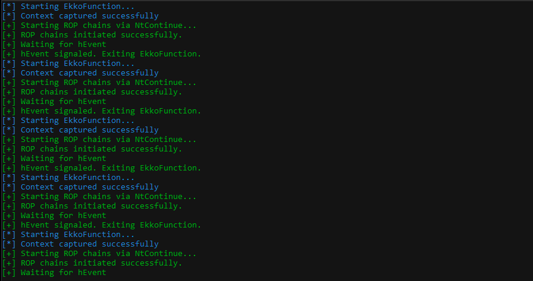
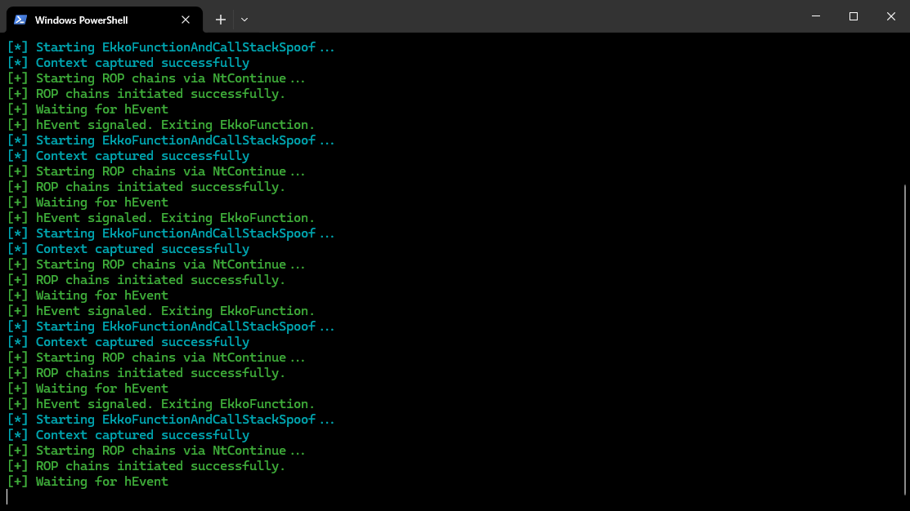
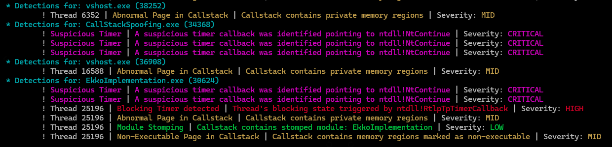
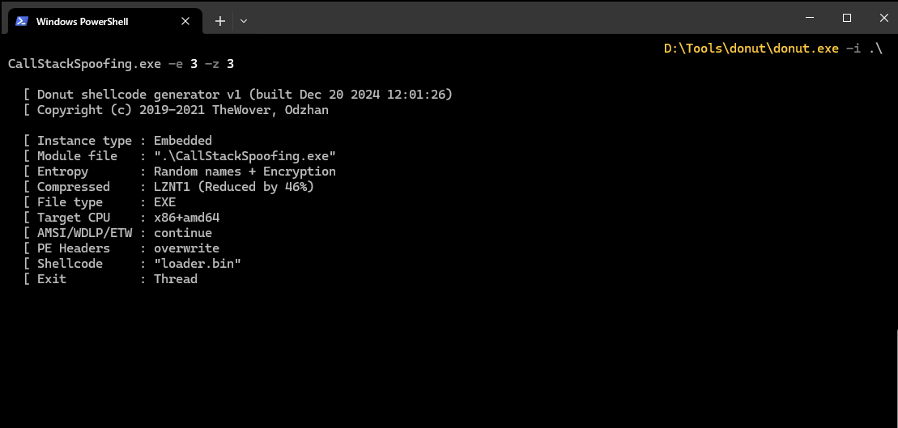
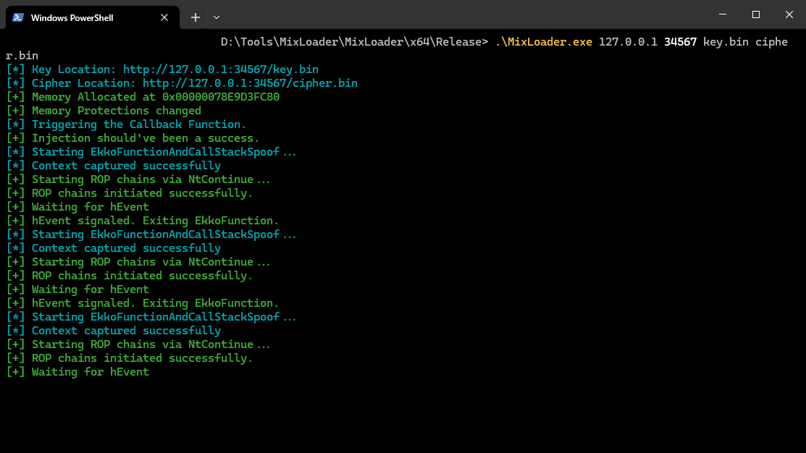
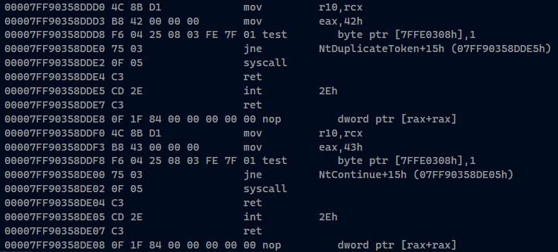
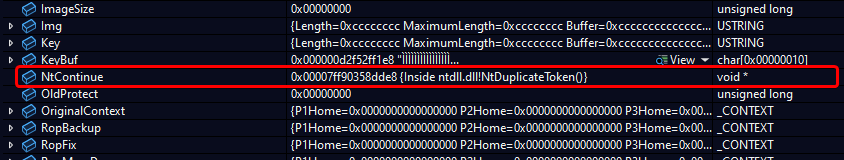
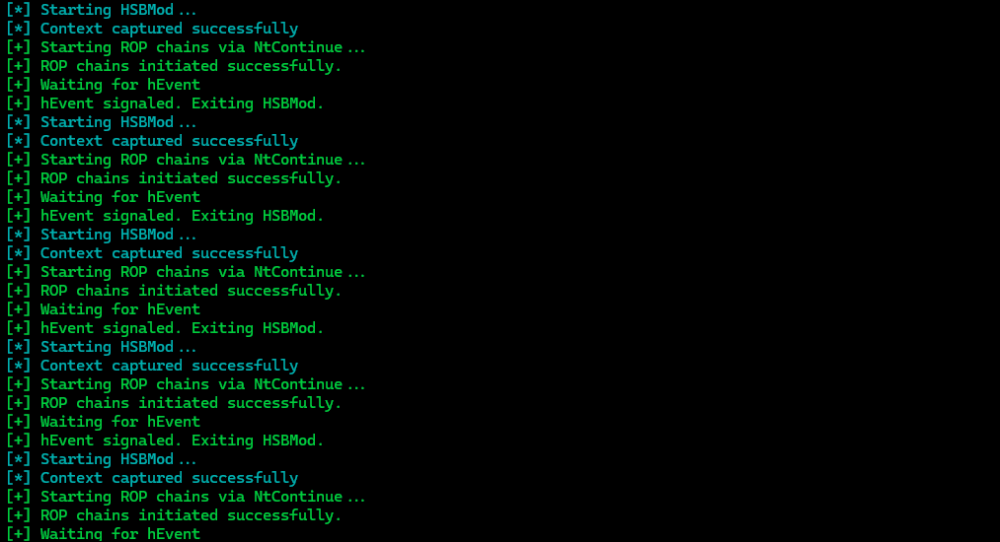
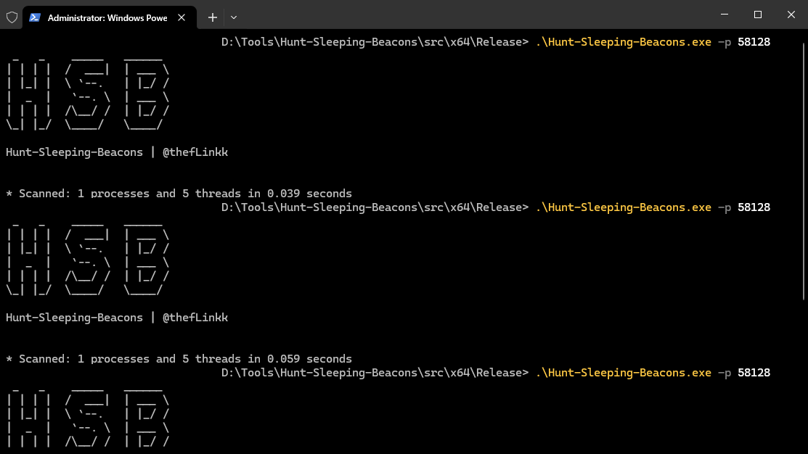
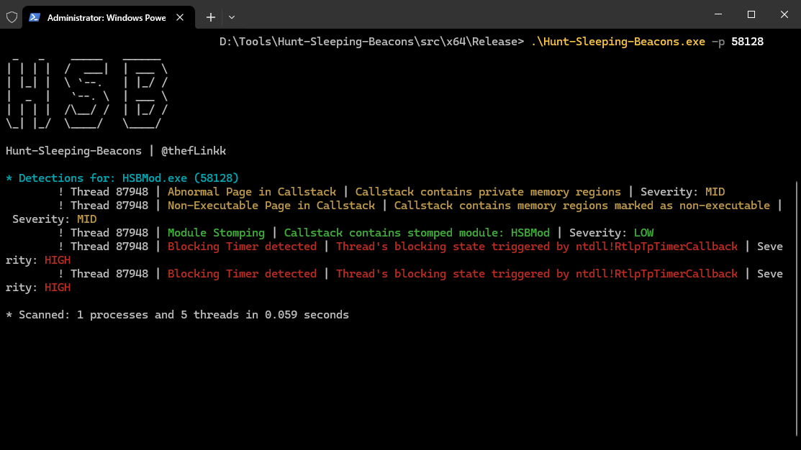

# Ekko

This is an ekko rebuild to understand what is actually happening when ekko sleep obfuscation takes place.
Original Code : [Cracked5pider](https://github.com/Cracked5pider/Ekko)

## Ekko Flow
1. Obtain the context of current thread
2. Clone the context to multiple variables
3. Modify variables to resume execution as if they were about to execute functions in the execution sequence.
4. Use System timers to resume context using NtContinue in a particular sequence.
5. Wait for all the context based functions to execute.
6. Delete TimerQueue

Ideally, this would go in a a loop where the EkkoSleep will replace sleep for the time where an implant is gonna sleep and not be a decrypted payload in the memory.

## Execution Sequence
1. Make the whole image Read/Write.
2. Encrypt the whole image.
3. Sleep for whatever time.
4. Decrypt the whole image.
5. Make the whole image Read/Execute.
6. Set the event object that the main thread is waiting for.

# Call Stack Spoofing (Static)

This is a basic static implementation of static call stack spoofing done while the main thread is waiting for the hEvent. This code was built while following along [Dylan Tran's modification to Ekko](https://dtsec.us/2023-04-24-Sleep/), however, some extra code was required to be added, the code did not work out of the box, maybe since I did not run this through a shellcode loader.

## Ekko + CallStackSpoofing Flow
1. Obtain the context of current thread
2. Clone the context to multiple variables
3. Modify variables to resume execution as if they were about to execute functions in the execution sequence.
4. Use System timers to resume context using NtContinue in a particular sequence.
5. Wait for all the context based functions to execute.
6. Delete TimerQueue

Ideally, this would go in a a loop where the EkkoAndCSSSleep will replace sleep for the time where an implant is gonna sleep and not be a decrypted payload in the memory.

## Execution Sequence
1. Make the whole image Read/Write.
2. Encrypt the whole image.
3. Backup the original context of the main thread.
4. Spoof the call stack of the main thread.
3. Sleep for whatever time.
4. Decrypt the whole image.
5. Restore the call stack of the main thread.
5. Make the whole image Read/Execute.
6. Set the event object that the main thread is waiting for.

# Comparison

# Convert To Shellcode
I converted the CallStackSpoofing binary to shellcode using [donut](https://github.com/TheWover/donut), the same can be done for Ekko too and in general, probably any binary where this is being implemented. 

I used my own [MixLoader](https://github.com/JodisKripe/MixLoader) to encrypt the shellcode with a key and running the shellcode via a self injection through indirect syscalls and a callback function. 

The results were identical to how I was running the binary, only this time not only the shellcode got encrypted, the whole loader's image was getting encrypted during runtime and the stack was being spoofed properly throughout.

# HSBMod
This is a version on top of the Call Stack Spoofing solution hacked together to beat detections by HSB during the sleep. 
Funnily enough, there is only one line of code thats different here.

## Detections
The critical detections were talking about a timer pointing to NtContinue. 

## Approach
So my instinctive thoughts were to find a way to not make it point directly to NtContinue. Initially I was going to create a jmp routine to NtContinue or a different subroutine that will be a wrapper over NtContinue, but I soon realised that whatever I write will get encrypted when sleep is going on. So there are some more ways to do this which woudl be:
1. Create an external library having those subroutines.
2. Figure out a way to not encrypt that subroutine/Encrypt most of the binary and not that subroutine and surrounding stuff.
3. Find another way to point to NtContinue for execution without actually pointing it there.

Debugging my the CallStackSpoofing code, I realised that there indeed is a way to do this via the 3rd option. 

As is visible, the syscall stub right before the NtContinue stub end with `0F 1F 84 00 00 00 00 00` which is a representation for `nop` or "no operation". 
So, in theory if timer's callback pointer points to these few bytes(starting from `0F`), it will be in the address space of NtDuplicateToken and moreover when the execution begins, the first thing that will happen is a `nop` followed by execution of NtContinue. 

So just by adding a `NtContinue = (PBYTE)NtContinue - 0x08` to the code, HSB no longer thinks that this is callback is pointing to NtContinue, but we do execute NtContinue nonetheless.
Therefore HSB is beat (for now).  
Running HSBMod: 

Hunt Sleeping Beacons.  

## What is still Detected ?
In the time span after the sleep is done and actual execution is going on, you can see some alerts targetted at the `Sleep()` thats there and a few more which can be seen in other generic processes as well and can very well be ignored as false positives.  

# ToDo
- [x] Test as shellcode(donut).
- [x] Beat HSB in today's time(January 2026).
- [ ] Add branch for execution with APCs
- [X] [Report detection to HSB for new rules to evade](https://github.com/thefLink/Hunt-Sleeping-Beacons/issues/4) 
